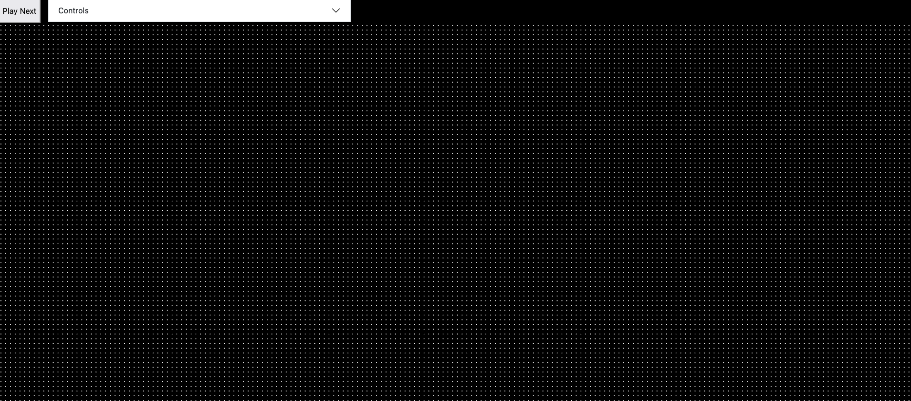
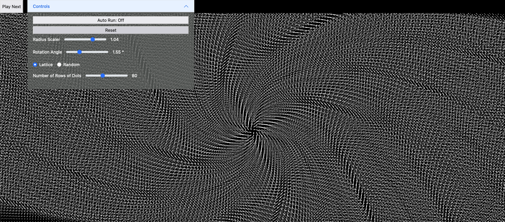
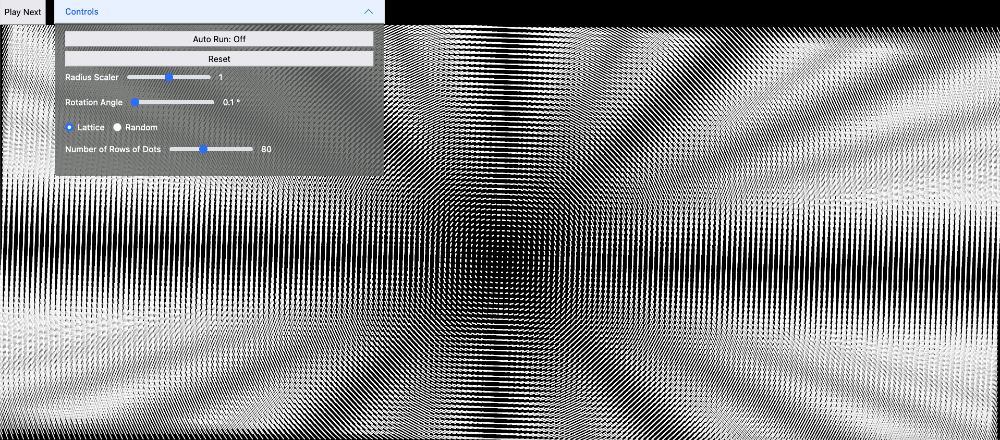
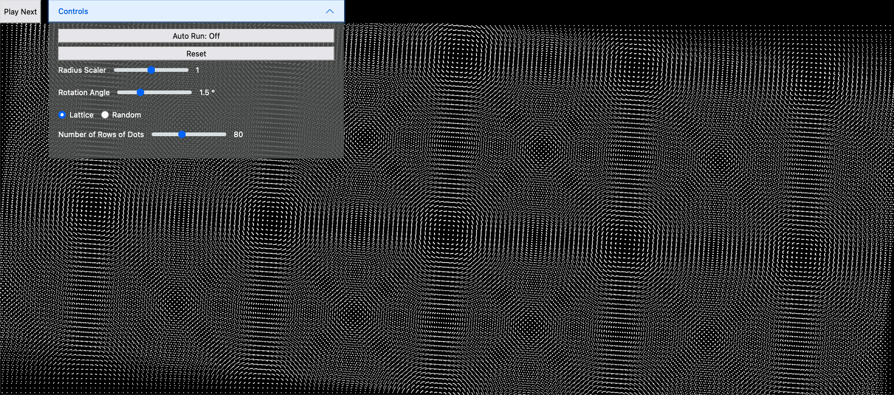
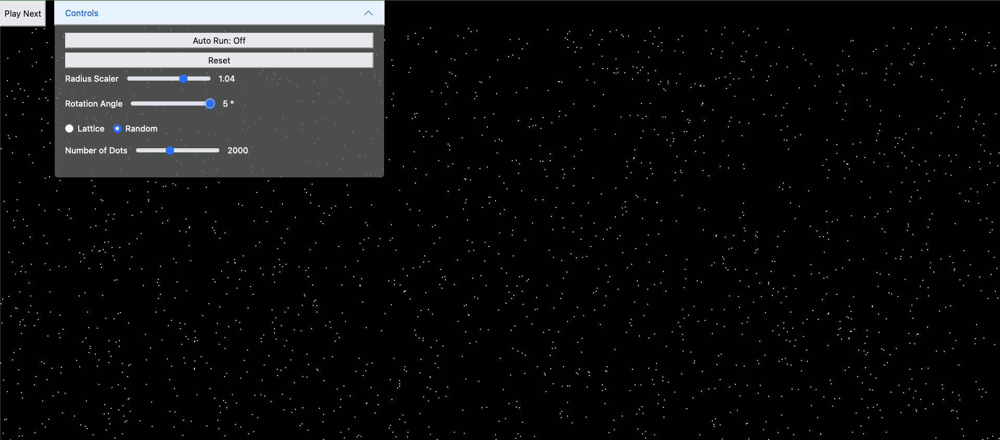
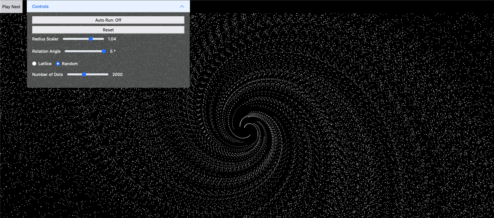

## Dot Patterns
<a href="https://bluebarryz.github.io/#/dot-patterns">bluebarryz.github.io/#/dot-patterns</a>

An animated game for creating beautiful patterns by rotating an array of dots on the screen. Runs on
desktop and mobile devices.

## How it works

The game is simple, but there are many possible patterns you can create. It starts off with a bunch of dots on the screen, arranged in either a grid/lattice or randomly scattered. Click 'Play Next' to rotate these dots by a certain angle (which you can set in the 'Controls' menu). There is also a control called 'Radius Scaler' which determines whether you want the dots to be rotated in a perfect circle (which would be a 1x radius scaler, i.e. the radius doesn't change), rotated outwards in a spiral (radius scaler > 1x), or inwards in a spiral (radius scaler < 1). Each time you click 'Play Next', the dots rotate again, and you can click 'Reset' to start over.

You can create some very interesting patterns with just these simple, small rotations!

## Cool Patterns - Examples

With a grid/lattice initial arrangement ...

... you can create ...

 

and with a random initial arrangement...

... you can create ...

